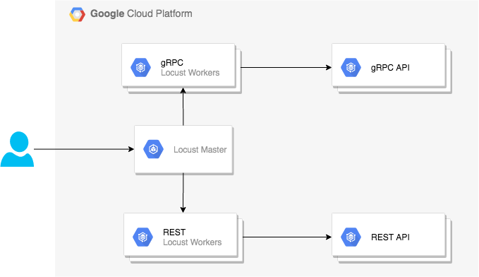

# Distributed Load Testing of REST/gRPC APIs using Locust

This project provides code and configuration for performing distributed load testing of REST and gRPC APIs. As described in [Distribute Load Testing Using GKE](https://github.com/GoogleCloudPlatform/distributed-load-testing-using-kubernetes), *"Load testing is key to the development of any backend infrastructure because load tests demonstrate how well the system functions when faced with real-world demands"*. 

As a use case for the Web APIs, we implement an API that serves predictions of a Machine Learning model. The problem at hand is an hypothetical *text classification/categorization* problem. A user can send a **predict** request with a string of text (to categorize), and the API will return the **predicted** category (an integer).

This project uses [Locust](https://locust.io/) as a tool for performing the load testing, i.e, for simulating users/clients making requests to the APIs. This tool can be used in standalone mode, but can also be executed on a distributed mode. In the latter, we will have a **master** running the Web UI and a set of **workers** simulating the actual users/clients. Running in distributed mode enables us to achieve a higher Requests Per Second (RPS) rate when testing the APIs. The RPS will be limited by either the API or the Locust workers throughput.

In the tests that are performed we will pay close attention to the RPS rate (throughput), the latency percentiles and to failure rates as well.

## Distributed Load Testing with Locust

As mentioned before, a single machine may not be enough to achieve the deseried RPS rate, therefore one needs to run the load tests across multiple nodes. Instructions on to run Locust in distributed mode can be found [here](https://docs.locust.io/en/stable/running-locust-distributed.html). 

In this project, we provide two *locustfiles* for each type of Web API (REST or gRPC). The `locust` package provides code to perform load testing of REST-based APIs, but it doesn't provide the same implementation for gRPC-based APIs. As such, we provide here the code that will allow us to test our gRPC API. Naturally, this code is not generic and is targeted for the Web API being tested in this project. Nevertheless, it's easy to extend to other use cases. 

The code for the *locustfiles* can be found in the `locust/` directory:

- `locust/locust_rest.py` used to simulate REST-based users/clients
- `locust/locust_grpc.py` used to simulate gRPC-based users/clients

## Web APIs

This section brifely describes the Web APIs implemented in this project that can be tested using the Locust Workers developed here.

- **Python REST** implemented using `fastapi`.
- **Python gRPC**
- **Go REST** implemented using `gorilla/mux`.
- **Go gRPC**

The code for the Web APIs can be found in the `apis/` folder, there is a subfolder for each of the programming languages for which there is at least one API implemented. There is also the directory `apis/protos/` which provides comon proto files used by the gRPC-based implementations, that are common to all programming languages.

## Running Tests on GKE

We will use a Kubernetes cluster to deploy and run our tests, in particular, we will use the **Google Kubernetes Engine** (GKE) to do this. Find below, instructions on how to setup GKE and create a k8s cluster.

### GKE Setup

Requirements:

- have a GCP account
- enable the relevant APIs
- `gcloud` and `kubectl` must be installed

Configure GCP Defaults:

```bash
$ PROJECT=locust-rest-grpc && \
REGION=europe-west2 && \
ZONE=${REGION}-b && \
CLUSTER=gke-load-test && \
gcloud config set compute/region $REGION && \
gcloud config set compute/zone $ZONE
```

Enable the relevant APIs:

```bash
$ gcloud services enable \
    cloudbuild.googleapis.com \
    compute.googleapis.com \
    container.googleapis.com \
    containeranalysis.googleapis.com \
    containerregistry.googleapis.com 
```

### Create a Cluster in GKE

A cluster 3 node cluster with 8 cores by node can be created using this command:

```bash
$ gcloud container clusters create $CLUSTER --machine-type=n1-standard-8
```

Get the credentials of the newly create GKE cluster, which will update the `~/.kubeconfig` file.

```bash
$ gcloud container clusters get-credentials $CLUSTER
```

### Continuous Integration

Given that we are using the Google Cloud for our tests, we will use the GCP's **Cloud Build** to build and upload the images into the GCP's **Container Registry**.

An automated build as been setup in Cloud Build which is trigger by any push to `master`. The configuration file for this build can be found in `cloudbuild/cloudbuild_all.yaml`. For each of the steps (individual artifacts) there is also an alternative `cloudbuild_<artifact>.yaml` file in the same directory. 

The triggered build will create (in case of success) the following images:

- `gcr.io/$PROJECT/locust` can be used to run the Locust Master or the the Workers in both REST and gRPC flavours.
- `gcr.io/$PROJECT/rest-go`
- `gcr.io/$PROJECT/grpc-go`
- `gcr.io/$PROJECT/rest-py`
- `gcr.io/$PROJECT/grpc-py`

The below command can be used for manually performing the same builds:

```bash
$ gcloud builds submit --config cloudbuild_all.yaml
```

### Run Locust and APIs

Now that we already have the cluster up and running and that we have build our images, we can launch our workloads and start running the load tests.

The below diagram shows a simplified view of what will be deployed. In practice, gRPC and REST workloads will be deployed in separate tests for maximizing the cluster utilization for each of the types of APIs.



#### Locust Master

The Locust Master should be launched using:

```
$ kubectl apply -f k8s/locust_master.yaml
```

This will create a `deployment` and a `service`. The latter is of type `LoadBalancer` and you need to check the external IP address so that one can access the Web UI in `http://<external-ip-address>:8089`.

#### Locust Workers

The Locust Workers should be launched using:

```
$ kubectl apply -f k8s/locust_worker_rest.yaml
```

The previous command shows how to run Locust Workers for simulating REST clients/users. A similar `k8s/locust_worker_grpc.yaml` exists for simulating gRPC clients as well. This command will create a `deployment` with the specified number of `replicas:`. This field will be changed depending on the test case.


#### Web APIs

As an example, we can deploy the gRPC Python API using the following command:

```
$ kubectl apply -f k8s/grpc-py.yaml
```

This will create a `deployment` and a `service`. The `service` should only be of type `LoadBalance` when one needs to directly test the API. The `replicas:` field in the `deployment` spec will be changed according to the test case.

For every other type of API implementation a `.yaml` is provided in the same folder.

### Cleanup

After all the tests have been performed, use the below command to delete the cluster and all workloads.

```bash
$ gcloud container clusters delete $CLUSTER --zone $ZONE
```

## Results

The full details of the tests performed and the respective results can be found [here](docs/results.md).

## Conclusions

TBD

## Links

- [Seldon-core Benchmarking](https://docs.seldon.io/projects/seldon-core/en/v1.1.0/reference/benchmarking.html)
- [Testing others systems using custom clients](https://docs.locust.io/en/stable/testing-other-systems.html)
- [Distribute Load Testing Using GKE](https://github.com/GoogleCloudPlatform/distributed-load-testing-using-kubernetes)
