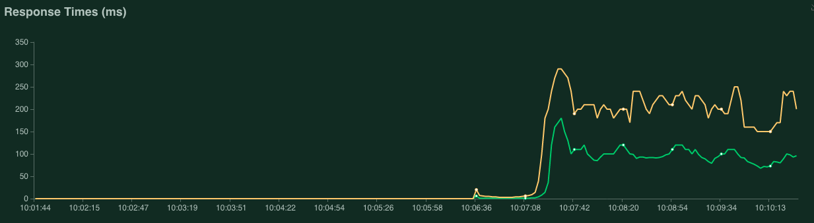

# Distributed Load Testing Results

This section provides the results of the distributed load tests performed using the various implemented APIs. The first set of tests were targeted to assess the performance of the APIs when using a single core. Next, the second set of tests evaluated the performance of the API when it was deployed in a single node with 8 cores. For the latter test case, there are two options: (i) 1 replica of the API using all the cores; or (ii) 8 replicas of the API each using 1 core.

The Locust master and workers were schedule on different nodes of the k8s cluster. For the master only one replica is deployed given it does not required a lot of computation power. The Locust workers were deployed as 14 replicas each of them configured for requesting 1 cpu for their processing work.


## Initial Setup

For making sure that the API replicas were scheduled in a single node, we have used the `nodeSelector` feature of k8s. First we labelled a node by running:

```bash
$ kubectl label nodes <node_id> workload=api
```

Then, we have added the following configuration in each of the API's `deployment` files.

```yaml
    spec:
      containers:
      ...
      nodeSelector:
        workload: api
```

## Tests using 1 CPU

In these tests the API deployments are configured to deploy a single replica and the underlying container requests a single cpu and has a limit of two cpus. As such, in pratice the pod will be able to use two cores when needed.

### REST Python


<details>
  <summary>Details</summary>




</details>

### REST Go


<details>
  <summary>Details</summary>


</details>

### gRPC Python


<details>
  <summary>Details</summary>


</details>


### gRPC Go


<details>
  <summary>Details</summary>


</details>


## Tests using 1 Node with 8 CPUs

### REST Python


<details>
  <summary>Details</summary>


</details>


### REST Python (single replica)


<details>
  <summary>Details</summary>


</details>

### REST Go


<details>
  <summary>Details</summary>


</details>

### gRPC Python


<details>
  <summary>Details</summary>


</details>

<details>
  <summary>Issues</summary>


</details>

### gRPC Python (single replica)


<details>
  <summary>Details</summary>


</details>

### gRPC Go


<details>
  <summary>Details</summary>


</details>

<details>
  <summary>Issues</summary>


</details>